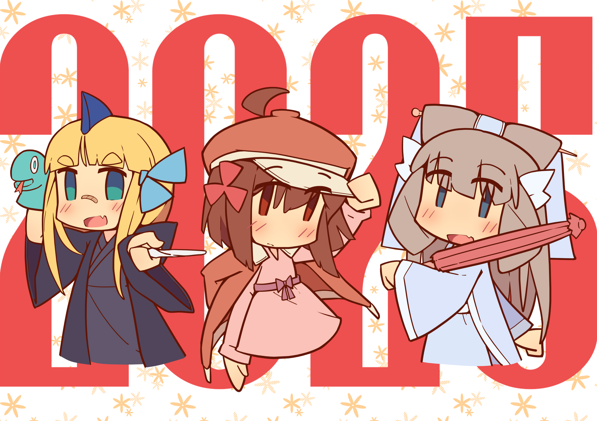
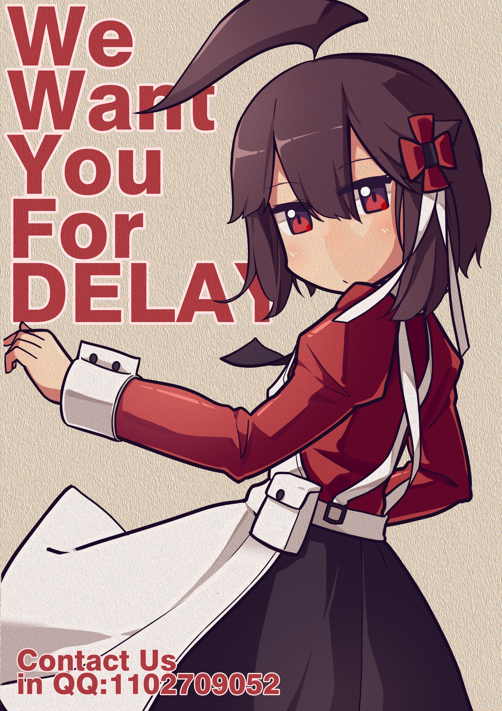
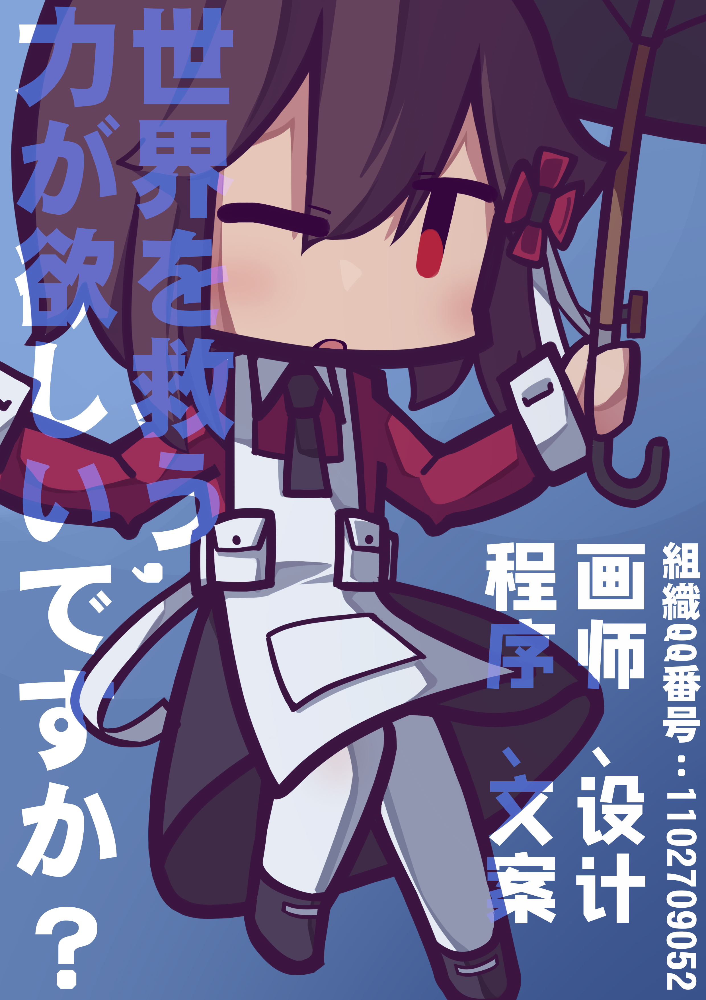

# Delay社

【Delay社】于2019年成立，以独立游戏项目的开发为主，将关于ACGN的原创创作作为社团活动内容，聚集了一众具备行动力与创新力的创作者并活跃至今。

活动形式线上线下并存，全职与业余成员皆有，线下据点驻扎于四川成都，为便于社团活动，注册有一家工作室。暂时在用爱发电，很穷。

## 关于我们的各个制作组

### 动画组：

- **逐帧动画：** 人物的逐帧动画绘制。
- **骨骼动画：** 怪物的骨骼动画制作。
- **其他动画：** 特效/ui/场景物品/交互制作。

### 场景组：

- **像素场景：** 2d像素场景素材制作(小规模物件)。
- **低模场景：** 低模场景模型制作(中规模物件)，低模贴图 和像素场景的工作有所重复。
- **体素场景：** 3d体素场景素材制作(大规模物件)，体素贴图 完成体素模型贴图。

### 策划组：

- **内容策划：** 技能/材料/制作/数值/怪物/战斗策划。
- **地图编辑：** 将场景素材于引擎中摆放组合，完成地图。

### 概念组：

- **概念设计：** 怪物/人设/设定/物品/建筑概念落实完成以上实际资源的制作。

### 文案组：

- **剧本撰写：** 主线类剧本/流程/分镜。
- **地理设定：** 从地理/城市规划等角度完善世界观。
- **游戏文案：** 描述/对话/补充资料/支线等。

### 程序组：

- **程序编写：** 无需多言啊~
- **技术美术：** 将场景外其它素材于引擎中导入微调。

### 宣发组：

- **平台运营：** 自主宣发的重任~
- **网站运营：** 搭建、运营、宣传我们的网站~
- **宣传材料：** 要是能另外招人就好了。

##### 后期：

- 音乐音效
- 游戏测试
- 周边负责

## 为何选择独立之路？

因为我们热爱亲手将天马行空的构想变为可玩、可感的现实。独立开发赋予我们**灵魂**：游戏的每一个细节都烙印着我们的思考、热情与坚持。我们享受与玩家社区的直接对话，你们的反馈和喜爱是我们前进路上最珍贵的燃料。我们拥抱挑战，在有限的资源下迸发无限的创意，这本身就是一场激动人心的冒险。

- **支持我们：** 如果有商店页面（如Steam愿望单链接）将游戏加入愿望单，就是对我们最大的鼓励！
- **联系我们：** 对于合作、媒体或其他事宜，请随时[联系我们](#)。
- **加入我们：** 寻找志同道合的伙伴！

感谢你花时间了解Delay社。我们不只是制作游戏，我们是在创造值得被铭记的体验。期待在游戏中与你相遇！

